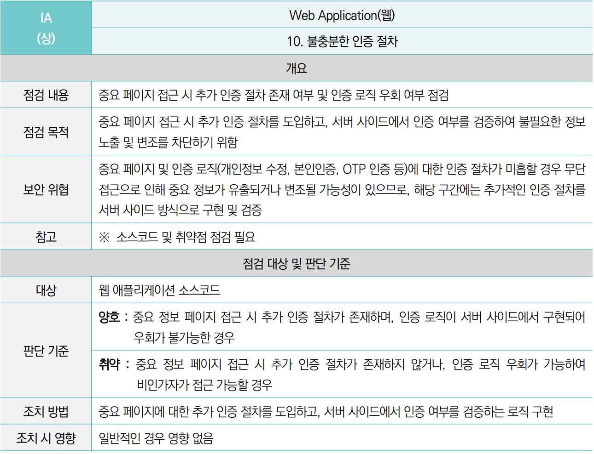

# 13. 불충분한 인증 (Insufficient Authentication)

## 1. 개요 (Overview)
- **정의**: 민감한 정보를 다루거나 중요 기능을 수행하는 웹 페이지에서, **사용자의 신원(로그인 여부)을 제대로 확인하지 않아** 비인가자가 접근할 수 있는 취약점.
- **위험도**: **상 (High)** / 관리자 권한 탈취 가능
- **영향**:
    - **관리자 페이지 무단 접근**: 로그인 없이 URL 입력만으로 관리자 기능 수행.
    - **중요 정보 유출**: 타인의 개인정보나 기업 기밀 열람.

> **💡 핵심 원리 (Forceful Browsing)**
>
> "대문(로그인 페이지)은 잠겨있는데, 창문(내부 페이지 URL)으로 바로 들어가면 막는 사람이 아무도 없다."

---

## 2. 공격 메커니즘 (Attack Vector)


### 시나리오: 관리자 페이지 URL 추측 (Forceful Browsing)
일반적으로 관리자 페이지에는 로그인 버튼이 없거나 숨겨져 있음.

**1. URL 추측 (Guessing)**
- 해커가 브라우저 주소창에 일반적인 관리자 경로를 입력해봄.
- `/admin/main.jsp`, `/manager/list.do`, `/adm/member_list`

**2. 요청 전송 (Request)**
- 해커는 로그인을 하지 않은 상태.
- 브라우저가 해당 URL로 `GET` 요청을 보냄.

**3. 인증 부재 (Missing Auth Check)**
- 서버(`member_list.jsp`)가 **"이 사람 로그인했나?"** 확인하는 코드가 없음.
- **결과**: 로그인 안 한 해커 화면에 전체 회원 명단이 쫙 뜸.

---

## 3. 취약한 코드 vs 안전한 코드 (Java/JSP)

이 취약점의 핵심은 **"모든 페이지"에서 인증을 검사**해야 한다는 것입니다.

### ❌ 취약한 코드 (검증 없음)
> 로그인 페이지(`login.jsp`)에만 인증 로직이 있고, 정작 중요한 내부 페이지에는 아무 확인도 안 함.

```jsp
<h2>관리자 페이지입니다.</h2>
<button onclick="deleteUser()">회원 삭제</button>
```

### ❌ 취약한 코드 (클라이언트 검증 - 우회 가능)
자바스크립트로 막는 건 보안이 아님. (URL 직접 호출이나 프록시 툴로 우회 가능)

```html
<script>
    if (document.cookie.indexOf("isAdmin") == -1) {
        alert("관리자만 접근 가능");
        history.back(); // 해커는 브라우저에서 JS 끄고 들어옴
    }
</script>
```

### ✅ 안전한 코드 1 (JSP 상단 체크 - 기본)
모든 중요 페이지의 최상단에 세션 검사 로직을 넣음. (하지만 페이지가 100개면 100번 복붙해야 해서 실수하기 딱 좋음)

```java
<%
    // 세션이 없거나, admin 권한이 아니면 튕겨냄
    String role = (String) session.getAttribute("role");
    if (role == null || !"ADMIN".equals(role)) {
        response.sendRedirect("/error/no_auth.jsp");
        return;
    }
%>
<h2>관리자 페이지입니다.</h2>
```

### ✅ 안전한 코드 2 (Filter/Interceptor - 권장)
[Best Practice] 개별 페이지에서 검사하지 말고, **대문(Filter)**에서 일괄적으로 검사함.

```java
// AuthFilter.java (모든 요청을 가로채서 검사)
public void doFilter(ServletRequest req, ServletResponse res, FilterChain chain) {
    HttpServletRequest request = (HttpServletRequest) req;
    HttpSession session = request.getSession(false);

    String uri = request.getRequestURI();
    
    // 1. 로그인이 필요한 페이지인지 확인 (예: /admin/*)
    if (uri.startsWith("/admin/")) {
        // 2. 세션 검증
        if (session == null || session.getAttribute("adminId") == null) {
            // 로그인 안 했으면 쫓아냄
            ((HttpServletResponse)res).sendRedirect("/login.jsp");
            return; 
        }
    }
    
    // 통과
    chain.doFilter(req, res);
}
```

## 4. 대응 방안 (Remediation Checklist)
1. 서버 사이드 검증 필수:

자바스크립트(JS)나 HTML 숨김 처리는 보안이 아니다. 반드시 **서버(Java)**에서 세션을 확인해야 한다.

2. 일괄 통제 적용 (Centralized Control):

개발자가 페이지를 만들 때마다 인증 코드를 넣으면 까먹을 수 있다.

**Filter(Servlet)**나 Interceptor(Spring), AOP를 사용하여 인증 로직을 중앙에서 관리한다.

3. URL 접근 제어:

웹 서버 설정(web.xml 등)을 통해 특정 디렉토리(/admin/*)는 인가된 사용자만 접근 가능하도록 설정한다.


## 5. 심화

1. 숨김 처리(Hidden)와 불충분한 인증

숨김 처리: 관리자 메뉴 버튼을 일반 사용자 화면에서 display: none으로 안 보이게만 한 것. (URL 알면 들어가짐 -> 취약)

불충분한 인증: URL로 들어왔을 때 서버가 문을 열어주는 것.

결론: 버튼을 숨기는 건 UI/UX일 뿐이고, 보안 조치는 서버에서 요청을 막는 것이어야 함.

2. 인증 vs 인가

처음 가상 환경에서 진단을 할 때에도, 팀원들과 인증과 인가에 대해서 논의했던 기억이 있다.

일단 주통기기반으로 비교해보자.

중요페이지에 접근 시 추가 인증을 하는지?


접근제어가 필요한 중요 페이지의 통제수단이 적절한지?

같은말 아닌가? 라고 생각해서 당시 인증과 인가에 대한 기준이 모호해졌던 경험이 있다. 한 가이드라인에서 한글자만 다른 취약점 항목이 모두, 중요 페이지에 접근하는 통제수단이 적절한지에 대한 것이다.

일단 인증과 인가의 정의를 살펴보자.

entrust의 인증과 인가에 대한 글이다.

결국 인증은 **"who are you?"** 너는 누구세요?

그리고 인가는 **"What can you do?"** 니가 뭐 할 수 있는데요?

라고 생각하면 편할 것 같다.
인증은 신원을 확인해야하고(로그인), 인가는 권한 검증(관리자인지 일반사용자인지 등)을 해야한다.

이해하고 나니 왜 나누어놓았는지 알겠다. 
근데 왜 13번이랑 17번, 그러니까 왜 안 붙여놓았는지는 잘 모르겠다.
그래서 2026년도 기준으로 주통기를 살펴보자.

3. 26년도 주통기



중요 페이지 접근시 인증 로직을 서버 사이드 방식에서 구현 및 검증을 해야한다.


패킷, 클라이언트 측 로직 변조 등 데이터 변조를 통해 사용자의 권한이 탈취되는 경우를 대비해, 서버 사이드에서 구현 및 검증을 해야한다.

21년도 기준 주통기와 26년도 기준을 비교해보면, 당연한 이야기이겠지만, 훨씬 전문적이고 구체적인 조치 방안을 놓고있다. 

좀 디테일 하게 살펴보자면, 

21년도 기준의 불충분한 인증은 중요 기능에 대한 재인증 여부에 초점을 둔다.

즉, 페이지나 기능들을 사용할 때 사용자가 맞는지? 를 제대로 물어보냐는 것이다.

26년도 기준의 불충분한 인증 절차는, 인증이 이루어지는 **프로세스의 무결성**에 초점을 두고있다. 로직 우회가 가능한 경우 까지도 점검 대상이고 판단의 기준이되는 것이다.

21년도 기준의 불충분한 인가는 접근 제어 실패항목이 있냐?에 초점이 가있고, 26년도 기준의 불충분한 권한 검증은 서버가 요청마다 **권한을 제대로 검사**하는지에 초점을 두고있는 것이다. 즉, 검증 로직의 부재 혹은 검증 로직 미흡을 잡아내는 것이다.

21년도 기준은 비인가 자원에 대한 단순 접근 권한 가능 여부를 판단하나, 26년도 기준은 서버 측에서 모든 요청에 대해 올바른 접근 권한을 실시간으로 검증하는지를 심층적으로 판단한다고 봐야한다.

