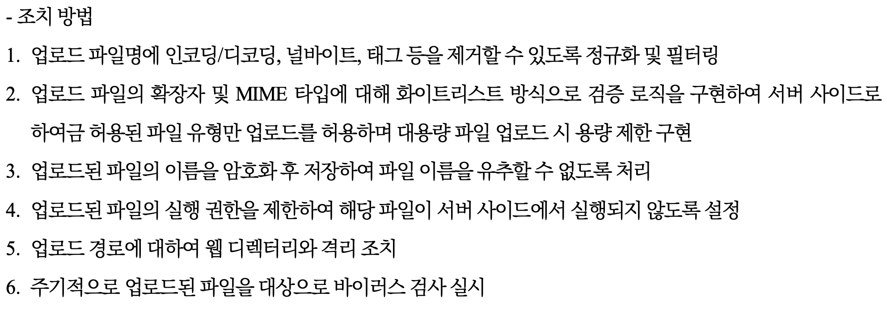
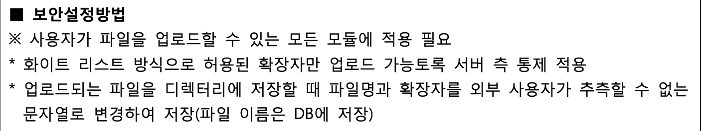
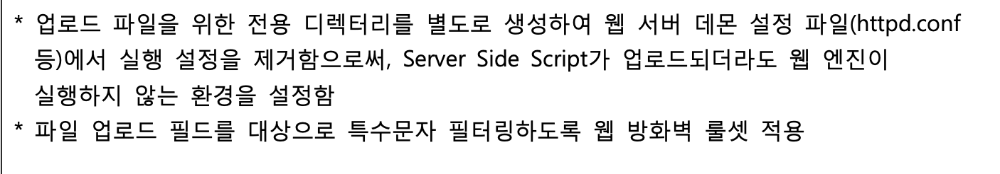

# 22. 파일 업로드 (File Upload)

## 1. 개요 (Overview)
- **정의**: 게시판, 프로필 사진 변경 등 파일 첨부 기능을 통해 악성 파일(Web Shell, 악성코드 등)을 서버에 업로드하고, 이를 실행시켜 시스템 제어권을 탈취하는 취약점.
- **위험도**: **최상 (Critical)** / 시스템 완전 장악
- **영향**:
    - **웹 쉘(Web Shell) 실행**: 서버 내부 명령어 실행(`cmd.exe`, `/bin/sh`)을 통해 파일 열람, 수정, 삭제 및 DB 탈취.
    - **랜섬웨어 유포**: 업로드된 파일을 통해 방문자 PC 감염.
    - **서비스 거부(DoS)**: 대용량 파일 업로드로 디스크 용량 고갈.

> **💡 핵심 원리 (Remote Code Execution)**
>
> "트로이 목마를 성 안으로 들이는 것과 같다. 겉보기엔 평범한 이미지 파일(`cat.jpg`)이지만, 서버가 이걸 실행하는 순간 성문(`shell`)을 활짝 열어주는 악성 스크립트(`cmd.jsp`)가 된다."

---

## 2. 공격 메커니즘 (Attack Vector)

### 시나리오: 웹 쉘 업로드 및 실행
**1. 파일 업로드 시도**
- 해커가 `cmd.jsp` (JSP 웹쉘) 파일을 작성함.
- "이미지 업로드" 기능에 해당 파일을 첨부하여 업로드 시도.

**2. 필터링 우회 (Bypass)**
- 만약 `.jsp` 확장자를 막았다면?
    - **확장자 변조**: `cmd.jsp.`, `cmd.JSP`, `cmd.jsp%00.jpg` (Null Byte Injection)
    - **Content-Type 변조**: 프록시 툴로 `text/html`을 `image/jpeg`로 속여서 전송.
    - **이중 확장자**: `cmd.jpg.jsp` (Apache 설정 미흡 시 뒤에서부터 해석하여 실행됨)

**3. 경로 파악 및 실행**
- 업로드 성공 시, 이미지 경로(예: `/uploads/cmd.jsp`)를 알아냄.
- 브라우저 주소창에 해당 경로를 입력하여 접속.
- **결과**: 서버가 해당 파일을 '이미지'가 아닌 '프로그램'으로 인식하고 실행시켜, 해커의 브라우저에 관리자 프롬프트가 뜸.

---

## 3. 취약한 코드 vs 안전한 코드 (Java/Spring)

핵심은 **"확장자 검사는 화이트리스트로"**, **"파일명은 난수화"**, 그리고 **"실행 권한 제거"**.

### ❌ 취약한 코드 (블랙리스트 방식 & 원래 이름 저장)
> 위험한 확장자(`exe`, `jsp`, `sh`)만 막는 방식. 해커는 `jspx`, `php`, `asp` 등 우회할 방법을 수백 가지 알고 있음.

```java
// FileUploadController.java
public String upload(MultipartFile file) {
    String filename = file.getOriginalFilename(); // 취약점 1: 원래 파일명 그대로 저장
    String ext = filename.substring(filename.lastIndexOf(".") + 1);

    // 취약점 2: 블랙리스트 방식 (구멍이 숭숭 뚫림)
    if ("jsp".equals(ext) || "exe".equals(ext)) {
        return "fail";
    }

    // 파일 저장 (webroot 아래에 저장하여 바로 실행 가능하게 함 - 위험)
    File target = new File("C:/webapp/uploads/" + filename);
    file.transferTo(target);
    return "success";
}
```

### ✅ 안전한 코드 (화이트리스트 & 난수화 & 외부 경로 저장)
>허용된 확장자(`jpg`, `png`)만 받고, 파일명을 랜덤하게 바꾸며, 웹 루트 밖에 저장함.

```java
// FileUploadService.java
public String safeUpload(MultipartFile file) {
    // 1. 허용된 확장자 리스트 (Whitelist)
    String[] allowedExt = {"jpg", "jpeg", "png", "gif"};
    String originalName = file.getOriginalFilename();
    String ext = originalName.substring(originalName.lastIndexOf(".") + 1).toLowerCase();

    // 2. 확장자 검증
    boolean isAllowed = Arrays.asList(allowedExt).contains(ext);
    if (!isAllowed) {
        throw new SecurityException("허용되지 않은 파일 형식입니다.");
    }

    // 3. 파일명 난수화 (UUID 사용) - 덮어쓰기 방지 및 실행 방해
    String savedName = UUID.randomUUID().toString() + "." + ext;

    // 4. 저장 경로를 WebRoot 외부로 설정 (매우 중요)
    // 브라우저에서 URL로 직접 접근 불가능한 경로
    File target = new File("C:/secure_uploads/" + savedName);
    
    file.transferTo(target);
    return savedName; // DB에는 변경된 파일명 저장
}
```

## 4. 대응 방안 (Remediation Checklist)
1. 화이트리스트(Whitelist) 필터링:

- 허용할 파일 확장자(예: 이미지용 jpg, png 등)를 명시적으로 지정하고, 그 외에는 **전부 차단(Deny All)** 한다.

2. 파일명 난수화 저장:

- 업로드된 파일을 저장할 때, 사용자가 올린 파일명(shell.jsp)을 그대로 쓰지 말고 UUID나 타임스탬프를 조합하여 예측 불가능한 이름(a1b2c3d4.png)으로 변경한다.

3. 저장 경로 분리 (WebRoot 배제):

- 업로드된 파일이 저장되는 디렉토리를 웹 애플리케이션 루트(webapp/, public/) 밖으로 설정한다.

- 사용자가 URL로 해당 파일에 직접 접근하여 실행하는 것을 원천 봉쇄한다. (다운로드 시에는 별도의 컨트롤러를 통해 스트림으로 읽어줌)

4. 실행 권한 제거:

- 업로드 디렉토리(upload/)의 속성을 설정하여 스크립트 실행 권한을 제거한다.

- Apache: .htaccess 파일 생성 -> php_flag engine off

- IIS: 처리기 매핑에서 스크립트 실행 권한 제거.

## 5. 심화

1. 이미지 파일인 척 위장하기 (Magic Number Check) 

File Signature 검증이라고도 한다. 
해커가 cmd.jsp 파일의 확장자만 .jpg로 바꾸고 업로드할 수 있다.

취약점: 서버가 단순히 확장자 문자열만 검사하면 통과된다.

대응: 파일의 헤더(Magic Number)를 읽어서 진짜 이미지 파일인지 검증해야 한다. (Java의 ImageIO나 Tika 라이브러리 활용)

2) 웹 쉘을 이미지 속에 숨기기 (Polyglot / Steganography)

공격: 유효한 이미지 파일의 바이너리 데이터 중간이나 끝부분(Exif 정보 등)에 악성 PHP/JSP 코드를 삽입한다.

결과: 이미지 뷰어에서는 정상적으로 보이지만, 서버가 이 파일을 include 하거나 실행 엔진에 넘기면 악성 코드가 실행된다.

대응: 업로드된 이미지를 Re-sizing(재가공) 하거나 포맷을 변환하여 저장하면, 숨겨져 있던 악성 코드가 깨져서 무력화된다.

3. 21 vs 26

먼저 26년도 기준의 대응방안을 보자.


다음은 21년도 기준이다.




26년도의 보안 정책들을 정리해보면

1. Content-Type이나 NULL Byte 우회 방지
2. MIME와 확장자 화이트리스트 및 용량 제한
3. 파일명 난수화
4. 업로드 파일 경로 격리 및 실행권한 제거
5. 주기적으로 스테가노그라피 점검

정도겠다.

4. Extra: Zero-Trust와 현실적인 방어전략

위 방법 외에 생각을 해봤다. Re-sizing 기법이면 다 방어가 되지 않을까도 싶은데 사실 로직 상 구현하는 난이도도 그렇고, 리소스도 그렇고 조금 비현실적인 것 같기도 하다. 당연하게도 가장 좋은 것은 Zero-Trust 관점에서 유입되어지는 모든 파일에 대해서 아무것도 신뢰하지 않는다고 가정하면 해결되긴 한다.

파일명 + 확장자를 난수화 하여 저장하는 방법도 있을 것이고.. 

모의 기술 면접에서 웹 애플리케이션 취약점 중 가장 영향도가 높고 중요하다고 생각되어지는 취약점으로 필자는 해당 취약점을 골랐다.

OS Command Injection이 가장 영향력이 높겠지만, 해당 취약점은 발생할 가능성이 거의 없다. 어느 웹 사이트가 웹에 OS의 명령어를 수행하고자 하겠는가?

중요하다고 하는 SQL Injection이나 CSRF 취약점은 웹 쉘 실행으로 RCE가 가능한 파일 업로드 보다는 영향도가 높지 않다고 판단했다. (물론 전부 다 위험한 취약점은 맞음.)

결국 업로드 경로의 분리와 실행 권한 제거가 핵심인가도 싶다.(이 경우는 절대로 우회가 안되려나? 비즈니스 로직 상 DB나 다른 폴더에 넘어가는 경우는 생각하지 않고.)